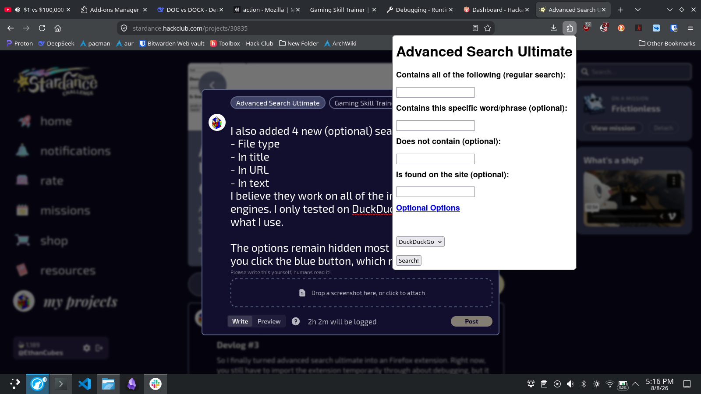

# Advanced Search Ultimate
A webpage/extension that adds easier advanced searching for DuckDuckGo, StartPage, and other alternative search engines, since most of them require memorization of a lot of search operators.

## [Try It](https://ethancubes.github.io/advanced-search-ultimate/)

## Quickstart
Note that the extension is not on the Chrome extension stores, because the Chrome Web Store costs money.
The Mozilla Store link (for Firefox-based browsers) is [here](https://addons.mozilla.org/en-US/firefox/addon/advanced-search-ultimate/).
An alternative way to test this extension is to go to the version of the extension hosted as web page on [GitHub Pages](https://ethancubes.github.io/advanced-search-ultimate/), which has all the features of extension, except that it's not an extension.
If you really want the extension version on Chromium, just download the extension files from [GitHub](https://github.com/EthanCubes/advanced-search-ultimate/releases/tag/v1.0.1)

## How to run locally
Download the extension files from [GitHub](https://github.com/EthanCubes/advanced-search-ultimate/releases/tag/v1.0.1)
It's definitely easiest to just install them in their packaged format, but if you really want to "build" them from scratch, then uhhh... keep reading IG.
Side note, place the zipped files in a new empty folder before unzipping them to prevent the browser from thinking the other files in the directory are also part of the extension, because Firefox requires me to package the contents instead of the folder that houses the contents.
### Chrome and Chromium-Based
1. Go to the Chrome Extension Page at `chrome://extensions`
2. You now have 2 options: Importing the CRX file, or importing an unpackaged extension.
To import the CRX file:
1. Download the CRX file from GitHub, and drag the file into the extensions page.
2. That's it, the extension should be loaded, unless Chrome decides to think the extension is malware, in which case use the next method.
To import the extensions as an unpacked extension
1. Download the Chrome version of the extension ZIP file from GitHub. There are two separate versions, MAKE SURE TO SELECT THE CHROME VERSION
2. Unzip the extension
3. In the Chrome extensions page, select the option to enable developer mode.
4. Select load unpacked, and navigate to the unzipped extension. Select the manifest.json inside the unzipped extension folder. That should load the extension onto the browser
### Firefox and other Gecko-based
The Firefox extension isn't approved yet, so you can't actually import the extension as a single ZIP file or extension file. Therefore, at least for now, you have to load the unpacked extension.
1. Download the Firefox version of the extension ZIP file from GitHub. There are two separate versions, MAKE SURE TO SELECT THE FIREFOX VERSION
2. Unzip the extension
3. Go to the Firefox debugging page at `about:debugging` go to the "This Firefox" (or "This LibreWolf or whatever) page.
4. Select `Load temporary addon`, navigate to the extension's manifest.json and select it to load the extension.

## Features
- Generates an advanced search query from user prompts, no memorization required.
- Brings the user to the search engine page with the prompt entered in.
- Saves time by searching from the browser extension without having to open a new tab to search
- Saves mental capacity by not requiring memorization
- Works with most search engines including Google, DuckDuckGo, StartPage, Bing, and Ecosia.

## How it works
Essentially, the user inputs search terms that they want to search in the specified fields. The terms are seperated by space (except for the "specific word or phrase" and the website) and sorted into an object containing arrays. The specified modifiers are added to the elements in the array, and the elements all get converted into a single string. It used to be a query that the user could just copy into any search engine, but the query didn't work well in URLs, so the program now uses percentage encoding.

A prefix is added to the string according to which search engine is selected, and the user is directed to a search page of the selected search engine with the query entered.

This improves on efficiency by allowing not requiring users to have to memorize the advanced search operators, with the bonus of being able to search from every site.

## Credits
- Favicon icon from [Google Fonts Material Symbols and Icons](https://fonts.google.com/icons), converted from .png to .ico with [CloudConvert](https://cloudconvert.com/png-to-ico).
- [Wikipedia](https://en.wikipedia.org/wiki/Percent-encoding) and [arenasbob2024-cell on Dev.to](https://dev.to/arenasbob2024cell/url-encoding-explained-what-20-3a-and-2f-actually-mean-8nh) helped with researching how URLs work.
- [Google's Advanced Search](https://www.google.com/advanced_search) was a good reference. 
- [Stack Overflow](https://stackoverflow.com/questions/16503879/chrome-extension-how-to-open-a-link-in-new-tab)
