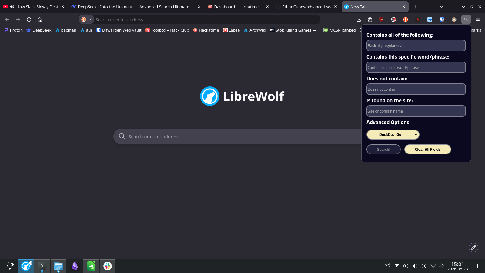

# Advanced Search Ultimate
A webpage/extension that adds easier advanced searching for DuckDuckGo, StartPage, and other alternative search engines, since most of them require memorization of a lot of search operators.

## [Try It Here](https://ethancubes.github.io/advanced-search-ultimate/)

## Quickstart
- For Firefox: Download from the Mozilla Store [here](https://addons.mozilla.org/en-US/firefox/addon/advanced-search-ultimate/).
- For Web Browser (without install): The [GitHub Pages](https://ethancubes.github.io/advanced-search-ultimate/), which has all the features of extension, except that it's not an extension. This is the best course of action for Chrome users & Safari users for testing this extension.
- Manual Install: If you want to install the Chrome version of the extension, check out the ["How to run locally"](#how-to-run-locally) section, since it costs money to put an extension on the Chrome Web Store.

## How to run locally
Download the packaged extension for both Chrome and Firefox from [GitHub](https://github.com/EthanCubes/advanced-search-ultimate/releases/tag/v1.0.1). For Firefox, download the ZIP file. For Chrome, install the .crx file.
### Chrome and Chromium-Based
1. Go to the Chrome Extension Page at [chrome://extensions](chrome://extensions)
2. Drag the .crx file into the window to install it. 
3. You will probably be warned that the extension is unsafe. As far as I know, this extension is perfectly safe, so I'd personally ignore it.
### Firefox and Firefox-based
It's easiest and recommended to download from the Mozilla Store, [here](https://addons.mozilla.org/en-US/firefox/addon/advanced-search-ultimate/).
1. Download the Firefox version of the extension ZIP file from GitHub. There are two separate versions, MAKE SURE TO SELECT THE FIREFOX VERSION
2. Unzip the extension
3. Go to the Firefox debugging page at `about:debugging` go to the "This Firefox" (or "This LibreWolf or whatever) page.
4. Select `Load temporary addon`, navigate to the extension's manifest.json and select it to load the extension.
### (Backup, not recommended) Load Unpacked Extension
1. Download the ZIP file version of the extension from [GitHub](https://github.com/EthanCubes/advanced-search-ultimate/releases/tag/v1.0.1). Extract the zip file into any empty directory.
#### Chrome & Chromium-Based
1. Go to the [chrome://extensions](chrome://extensions)
2. Enable developer mode.
3. Select "Load Unpacked". Navigate to the manifest.json file that was extracted from the ZIP file.
#### Firefox & Firefox-Based
1. Go to the ["This Firefox" section in the about:debugging page](about:debugging#/runtime/this-firefox)
2. Select "Load Temporary Add-on". Navigate to the manifest.json file that was extracted from the ZIP file.

## Features
- Generates an advanced search query from user prompts, no memorization required.
- Brings the user to the search engine page with the prompt entered in.
- Saves time by searching from the browser extension without having to open a new tab to search
- Saves mental capacity by not requiring memorization
- Works with the most popular engines including Google, DuckDuckGo, StartPage, Bing, and Ecosia.

## How it works
Essentially, the user inputs search terms that they want to search in the specified fields. The terms are seperated by space (except for the "specific word or phrase" and the website) and sorted into an object containing arrays. The specified modifiers are added to the elements in the array, and the elements all get converted into a single string. It used to be a query that the user could just copy into any search engine, but the query didn't work well in URLs, so the program now uses percentage encoding.

A prefix is added to the string according to which search engine is selected, and the user is directed to a search page of the selected search engine with the query entered.

This improves on efficiency by allowing not requiring users to have to memorize the advanced search operators, with the bonus of being able to search from every site.

## Credits
- Favicon icon from [Google Fonts Material Symbols and Icons](https://fonts.google.com/icons), converted from .png to .ico with [CloudConvert](https://cloudconvert.com/png-to-ico).
- [Wikipedia](https://en.wikipedia.org/wiki/Percent-encoding) and [arenasbob2024-cell on Dev.to](https://dev.to/arenasbob2024cell/url-encoding-explained-what-20-3a-and-2f-actually-mean-8nh) helped with researching how URLs work. They're actually pretty interesting.
- [Google's Advanced Search](https://www.google.com/advanced_search) was a good reference. 
- [Stack Overflow](https://stackoverflow.com/questions/16503879/chrome-extension-how-to-open-a-link-in-new-tab)
- The font used was [Cairo](https://fonts.google.com/specimen/Cairo).
- The popup design and color scheme are inspired by the [Hack Club Stardance Website](stardance.hackclub.com)
- Colors were extracted from the Stardance website using [kColorChooser](https://apps.kde.org/kcolorchooser/)
